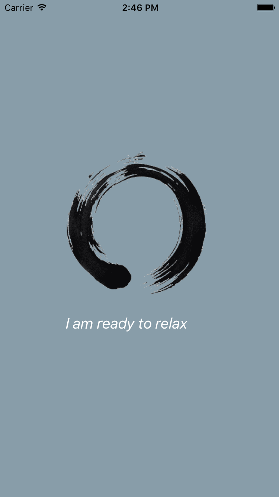
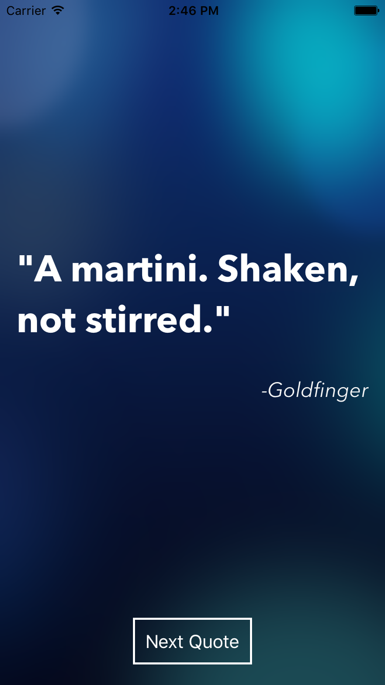

# Relaxation Station


A React Native application which uses the Andruxnet famous quote API

Please follow https://facebook.github.io/react-native/docs/getting-started.html to get your machine set up. 

To run the project, please type the following in the project root folder:
```sh
$ react-native run-ios
```

You should then be able to see the preview of the app in action in the simulator

Some concepts used in the project:
  - States and Props
  - External API calls
  - Styling in React Native (Background, Flexbox, Multiple Screens, Platform.OS)

  

    

